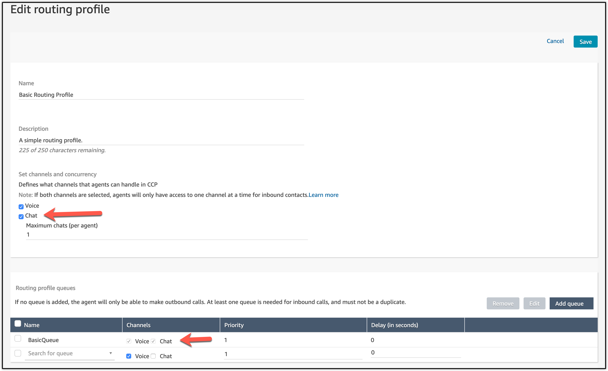

# Tactic Edge Chatbot
We forked this repo from an AWS provided solution.

CI/CD is setup to https://chatbot.tedevops.com/ for testing out the chatbot.

# Amazon Connect Chat UI Examples

This repo contains examples on how to implement the customer side of Amazon Connect chat. Please refer to the README under each solution to see the complete details as to what each solution does and how to deploy it.

Before working on projects in this repo, we suggest taking time to follow [the public AWS documentation](https://docs.aws.amazon.com/connect/latest/adminguide/amazon-connect-get-started.html) on Amazon Connect around chat.

## Solutions

At the moment, these are the solutions in this repo:

1) **[cloudformationTemplates/asyncCustomerChatUX](https://github.com/amazon-connect/amazon-connect-chat-ui-examples/tree/master/cloudformationTemplates/asyncCustomerChatUX)**
    The Async Customer Chat solution spins up a website that uses a pre-built chat widget for the customer side. It also contains AWS resources that help enable the asynchronous chat experience across devices.
2) **[cloudformationTemplates/startChatContactAPI](https://github.com/amazon-connect/amazon-connect-chat-ui-examples/tree/master/cloudformationTemplates/startChatContactAPI)**
    The Start Chat Contact API solution creates a simple API to start the chat from the customer side. Use this solution if you want to custom build your customer chat widget. There is also an example html file in this repo that shows you how to make subsequent calls to Chat JS to send messages between the customer and agent after the chat is started.
    
## Resources

Here are a few resources to help you implement chat in your contact center:
- [Amazon Connect ChatJS](https://github.com/amazon-connect/amazon-connect-chatjs)
- [Amazon Connect Streams](https://github.com/aws/amazon-connect-streams)
- [Amazon Connect Service SDK](https://docs.aws.amazon.com/connect/latest/APIReference/Welcome.html) (Download the SDK [here](https://github.com/aws/))
- [Amazon Connect Participant Service SDK](https://docs.aws.amazon.com/connect-participant/latest/APIReference/Welcome.html) (Download the SDK [here](https://github.com/aws/))
- [iOS Mobile SDK](https://github.com/aws-amplify/aws-sdk-ios)
    - [Amazon Connect Participant Service](https://cocoapods.org/pods/AWSConnectParticipant)
    - [Amazon Connect Service](https://cocoapods.org/pods/AWSConnect)
- [Android SDK](https://github.com/aws-amplify/aws-sdk-android)
    
## Enabling Chat in an Existing Amazon Connect Contact Center

If your instance was created before the release of the chat feature, here's an overview of what you need to do to enable chat, as well as what has changed.

1. Because you have an existing instance, you'll need to enable chat testing mode to use the simulated environment we've provided for testing. Follow these steps:
    1. In Amazon Connect, choose Users, Security profiles.
    2. Select the security profile that you want update, such as Admin.
    3. Expand Numbers and flows.
    4. For Chat test mode choose Enable/Disable.
    5. Choose Save. Now people who are assigned to that security profile will be able to use the simulated chat experience.
 
    *Note: Another option is to create a new security profile specifically for testing chat and assign testers to that profile.*

2. Enable Chat in your Routing Profile. Go into your instance's website and go to the Routing Profiles section. Edit the Routing Profile for your agent and add the Basic Queue to the profile with the chat channel enabled.

3. Your existing contacts flows will also work for chat! You just need to update them to specify how you want them to work. 
    We've added the following action blocks:
    - [Wait](https://docs.aws.amazon.com/connect/latest/adminguide/contact-blocks.html#wait)
    - [Set disconnect flow](https://docs.aws.amazon.com/connect/latest/adminguide/contact-blocks.html#set-disconnect-flow)
    
    And updated these blocks for chat:
    - [Play prompt](https://docs.aws.amazon.com/connect/latest/adminguide/contact-blocks.html#play)
    - [Get customer input](https://docs.aws.amazon.com/connect/latest/adminguide/contact-blocks.html#get-customer-input)
    - [Store customer input](https://docs.aws.amazon.com/connect/latest/adminguide/contact-blocks.html#store-customer-input)
    - [Set recording behavior](https://docs.aws.amazon.com/connect/latest/adminguide/contact-blocks.html#set-recording-behavior)
4. Your metric reports and the contact trace records will now reflect chat as a channel. Note the following metrics:
    - [Agent Activity](https://docs.aws.amazon.com/connect/latest/adminguide/real-time-metrics-definitions.html#agent-activity-state-real-time): This metric used to be named Agent Status. Existing reports that used Agent Status as the column name will start using Agent Activity as the column name.
    - [Availability](https://docs.aws.amazon.com/connect/latest/adminguide/real-time-metrics-definitions.html#availability-real-time): This metric has a new definition to account for chat. The change has no impact on metrics for voice calls.
    - [Capacity](https://docs.aws.amazon.com/connect/latest/adminguide/real-time-metrics-definitions.html#capacity-real-time): This is a new real-time metric.
    - [Contact State](https://docs.aws.amazon.com/connect/latest/adminguide/real-time-metrics-definitions.html#contact-state-real-time): This metric has a few changes so the states are better aligned to what the agent sees in the updated CCP.
    
    Check out the Real-time Metrics Definitions and Historical Metrics Definitions. These articles have been updated to reflect the addition of chat.
5. Enable Chat Transcripts in the Amazon Connect console by viewing your instance settings and clicking on the 'Data Storage' section and adding an S3 bucket in the 'Chat Transcripts' section.
    
6. If your business is using Amazon Lex bots in your contact center, and your Amazon Connect instance was created before October 12, 2018, we recommend doing the following step to ensure your service-linked role has "lex:PostText" permissions:
    - Add a new Amazon Lex bot (and then you can remove it). The act of adding the Amazon Lex bot will automatically update your permissions.
7. When you're ready to deploy the updated CCP, give the URL for it to those agents who are going handle voice and chat contacts, or only chat contacts. Those agents who are only handling voice contacts can continue using the original CCP. To learn more about the updated CCP interface, see [Chat with Contacts](https://docs.aws.amazon.com/connect/latest/adminguide/work-with-chats.html).
8. For instances created prior to October 12, 2018, the Test Chat experience in the Amazon Connect website is not available. Please follow instructions in the  [asyncCustomerChatUX solution](https://github.com/amazon-connect/amazon-connect-chat-ui-examples/tree/master/cloudformationTemplates/asyncCustomerChatUX) to deploy your own sample customer UI and test chat.

## License Summary

This sample code is made available under the MIT-0 license. See the LICENSE file.
