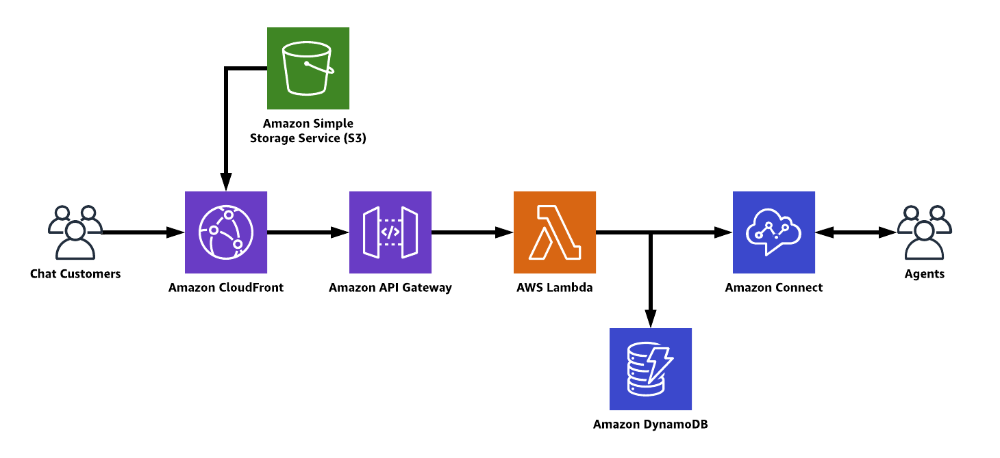

# Overview

This solution creates a simple website that enables a customer to start a chat with a pre-built widget. The end user enters their name and the username of the agent they would like to speak with and they'll then be put into that agent's queue. The stack creates a website hosted in [Amazon S3](https://aws.amazon.com/s3/) that is served by [Amazon CloudFront](https://aws.amazon.com/cloudfront/). The website calls an [Amazon API Gateway](https://aws.amazon.com/api-gateway/) endpoint that triggers an [AWS Lambda](https://aws.amazon.com/lambda/) function. This Lambda function invokes the [Amazon Connect](https://aws.amazon.com/connect/) Service [StartChatContact](https://docs.aws.amazon.com/en_pv/connect/latest/APIReference/API_StartChatContact.html) API, stores the result in [Amazon DynamoDB](https://aws.amazon.com/dynamodb/), and returns the result to the front end.


  
In addition to starting the chat and storing the result in the DynamoDB (DDB), the Lambda function helps determine whether the user has an active chat open. Before starting the chat, the Lambda function checks the DDB to see whether there is an existing chat open for that user. If so, the current chat is returned to the website instead of starting a new one. This enables your user to pick up the existing chat where they left off on any device. This functionality is possible by knowing who the user is and keeping track of whether there is an open chat session. An open chat session is determined by the presence of a chat transcript in S3. At the end of a chat conversation, when the chat transcript is uploaded to S3, a Lambda function is triggered to update the DDB with the S3 location of the chat transcript. If there is no S3 location for a chat then we assume the chat is still in session.

## Deployment Steps

### Pre-requisites

You need an Amazon Connect instance to deploy this [CloudFormation](https://aws.amazon.com/cloudformation/) template. You can use an existing one or create a new one by following our onboarding guide [here](https://docs.aws.amazon.com/connect/latest/adminguide/amazon-connect-get-started.html).

If you are using an existing instance, you may need to make a few changes to your instance to enable Chat.

1) Enable Chat Transcripts in the Amazon Connect console by viewing your instance settings and clicking on the 'Data Storage' section and adding an S3 bucket in the 'Chat Transcripts' section.

2) Enable Chat in your Routing Profile. Go into your instance's website and go to the Routing Profiles section. Edit the Routing Profile for your agent and add the Basic Queue to the profile with the chat channel enabled.


### Steps

| Region | Launch Button |
| ------ | ------------- |
| us-east-1 (N. Virginia) | [](https://console.aws.amazon.com/cloudformation/home#/stacks/new?stackName=asyncCustomerChatUX&templateURL=https://s3-us-east-1.amazonaws.com/us-east-1.amazon-connect-advanced-customer-chat-cfn/cloudformation.yaml) |
| us-west-2 (Oregon) | [](https://us-west-2.console.aws.amazon.com/cloudformation/home#/stacks/new?stackName=asyncCustomerChatUX&templateURL=https://s3-us-west-2.amazonaws.com/us-west-2.amazon-connect-advanced-customer-chat-cfn/cloudformation.yaml) |
| ap-southeast-2 (Sydney) | [](https://ap-southeast-2.console.aws.amazon.com/cloudformation/home#/stacks/new?stackName=asyncCustomerChatUX&templateURL=https://s3-ap-southeast-2.amazonaws.com/ap-southeast-2.amazon-connect-advanced-customer-chat-cfn/cloudformation.yaml) |
| ap-northeast-1 (Tokyo) | [](https://ap-northeast-1.console.aws.amazon.com/cloudformation/home#/stacks/new?stackName=asyncCustomerChatUX&templateURL=https://s3-ap-northeast-1.amazonaws.com/ap-northeast-1.amazon-connect-advanced-customer-chat-cfn/cloudformation.yaml) |
| eu-central-1 (Frankfurt) | [](https://eu-central-1.console.aws.amazon.com/cloudformation/home#/stacks/new?stackName=asyncCustomerChatUX&templateURL=https://s3-eu-central-1.amazonaws.com/eu-central-1.amazon-connect-advanced-customer-chat-cfn/cloudformation.yaml) |

1) Go into your instance and go to the Contact Flows page. Create a new contact flow and select 'Import flow' from the upper right hand corner. Import the 'Basic Chat Disconnect Flow' from the 'contactFlows/' in this repo and click 'Publish'. Follow the same steps for the 'Basic Chat Flow'.
2) Deploy the CloudFormation template from `https://s3-[region].amazonaws.com/[region].amazon-connect-advanced-customer-chat-cfn/cloudformation.yaml`
    - Replace the url with the appropriate region.
    - Read each field in the CloudFormation template and make the necessary updates
        - `WebsiteS3BucketName`: this should be the name of a *new* bucket that will be created on your behalf to store the website contents
        - `contactFlowId`: This is the id of the 'Basic Chat Flow' you imported in step 1. You can find the contact flow id when viewing the contact flow. For example, if the arn for your flow is 'arn:aws:connect:us-west-2:123456789012:instance/11111111-1111-1111-1111-111111111111/contact-flow/22222222-2222-2222-2222-222222222222', the contact flow id is '22222222-2222-2222-2222-222222222222'
        - `instanceId`: This is the id of the instance you want to use. You can find this on the Amazon Connect console or when viewing the contact flow. For example, if the arn for your flow is 'arn:aws:connect:us-west-2:123456789012:instance/11111111-1111-1111-1111-111111111111/contact-flow/22222222-2222-2222-2222-222222222222', the instance id is '11111111-1111-1111-1111-111111111111'
        - `AmazonConnectS3BucketName`: This is the bucket that holds the chat transcripts for your Amazon Connect instance. You can find this in the Amazon Connect console when viewing the Data Storage section in your instance details. E.g. If your instance has connect-xxx/connect/instanceName/ChatTranscripts, enter 'connect-xxx' 
        - `transcriptPath`: This is the path in the S3 bucket that contains the chat transcripts. You can find this in the Amazon Connect console when viewing the Data Storage section in your instance details. E.g. If your instance has connect-xxx/connect/instanceName/ChatTranscripts, enter 'connect/instanceName/ChatTranscripts'
3) Once the CloudFront distribution is ready, test!
    - Go to CloudFront and open the URL of the CloudFront Distribution that wast created. If you get an error saying it cannot read the file from S3, the CDN is not ready. It could take over an hour to be ready.
    - For the agent CCP, open the CCP url from Amazon Connect and change the `/ccp` portion of the URL to `/ccp-v2`
    - When entering the username, enter the username of the agent you would like to speak to. The Contact Flow connects the user to the agent specified in the username field.

## Adding this chat widget to your website

If you want to add this widget to your website instead of using the prebuilt UI, here are the steps to do so:

1. In your website's html code, import 'amazon-connect-chat-interface.js' and 'amazon-connect-chat-websockets.js'. Both of these files were copied into your S3 bucket that hosts the website created by this CloudFormation template.

    ```html
    <script src="amazon-connect-chat-interface.js"></script>
    <script src="amazon-connect-chat-websockets.js"></script>
    ```

2. Initialize the Chat Interface on page load:

    ```js
    $(document).ready((a) => {
      connect.ChatInterface.init({
        containerId: 'root' // This is the id of the container where you want the widget to reside
        });
    });
    ```

3. Start the chat based on a user action. You will want to add fields for the customer name and username because those fields are used in the Lambda function that was created.

    ```js
    connect.ChatInterface.initiateChat({
      name: customerName,
      username: username,
      region: ${region},
      apiGatewayEndpoint: "https://${apiId}.execute-api.${region}.amazonaws.com/Prod",
      contactAttributes: JSON.stringify({
        "customerName": customerName
      }),
      contactFlowId: "${contactFlowId}",
      instanceId: "${instanceId}"
    },successHandler, failureHandler)
    ```
