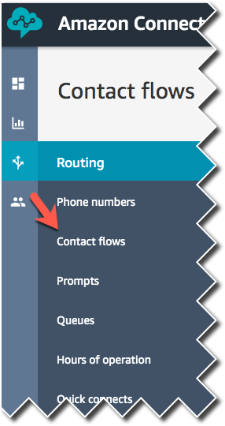
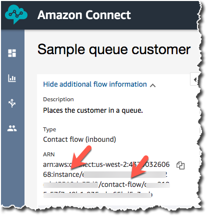
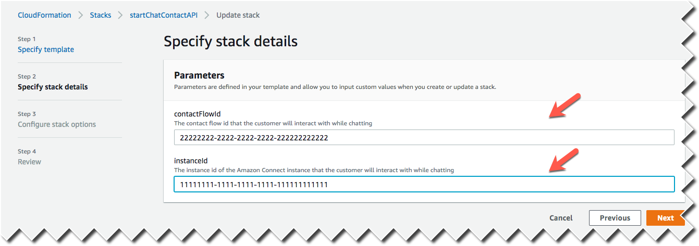

# Overview

Adding chat to your website is possible with a few easy steps. This solutions spins up an [Amazon API Gateway](https://aws.amazon.com/api-gateway/) endpoint that triggers an [AWS Lambda](https://aws.amazon.com/lambda/) function. This Lambda function invokes the [Amazon Connect](https://aws.amazon.com/connect/) Service [StartChatContact](https://docs.aws.amazon.com/en_pv/connect/latest/APIReference/API_StartChatContact.html) API and returns the result from that call. You could use the below pre built widget to get up and going. This solution is built on top of [Chat JS](https://github.com/amazon-connect/amazon-connect-chat-ui-examples.git). 

## [Getting started with Pre Built Widget](#Getting-started-with-Pre-Built-Widget)
## [Getting started with a Custom Widget](#Getting-Started-with-a-Custom-Widget)

### Pre-requisites

1. Create an Amazon Connect Instance by signing up [here](https://aws.amazon.com/connect/).
You need an Amazon Connect instance to deploy the below [CloudFormation](https://aws.amazon.com/cloudformation/) template. You can use an existing one or create a new one by following our onboarding guide [here](https://docs.aws.amazon.com/connect/latest/adminguide/amazon-connect-get-started.html).

    If you are using an existing instance, you may need to make a few changes to your instance to enable Chat. Follow the steps [here](https://github.com/amazon-connect/amazon-connect-chat-ui-examples/blob/master/README.md#enabling-chat-in-an-existing-amazon-connect-contact-center) to see what changes you need to make.

2. Once you create an Amazon Connect Instance, create a new contact flow, by picking **Sample queue customer** contact flow and **publish it**

     

3. Publish a CloudFormation template using one of the regions you prefer below. 

    | Region | Launch Button |
    | ------ | ------------- |
    | us-east-1 (N. Virginia) | [](https://console.aws.amazon.com/cloudformation/home#/stacks/new?stackName=startChatContactAPI&templateURL=https://s3.amazonaws.com/us-east-1.start-chat-contact-api-cfn/cloudformation.yaml) |
    | us-west-2 (Oregon) | [](https://us-west-2.console.aws.amazon.com/cloudformation/home#/stacks/new?stackName=startChatContactAPI&templateURL=https://s3-us-west-2.amazonaws.com/us-west-2.start-chat-contact-api-cfn/cloudformation.yaml) |
    | ap-southeast-2 (Sydney) | [](https://ap-southeast-2.console.aws.amazon.com/cloudformation/home#/stacks/new?stackName=startChatContactAPI&templateURL=https://s3-ap-southeast-2.amazonaws.com/ap-southeast-2.start-chat-contact-api-cfn/cloudformation.yaml) |
    | ap-northeast-1 (Tokyo) | [](https://ap-northeast-1.console.aws.amazon.com/cloudformation/home#/stacks/new?stackName=startChatContactAPI&templateURL=https://s3-ap-northeast-1.amazonaws.com/ap-northeast-1.start-chat-contact-api-cfn/cloudformation.yaml) |
    | eu-central-1 (Frankfurt) | [](https://eu-central-1.console.aws.amazon.com/cloudformation/home#/stacks/new?stackName=startChatContactAPI&templateURL=https://s3-eu-central-1.amazonaws.com/eu-central-1.start-chat-contact-api-cfn/cloudformation.yaml) |
    | eu-west-2 (London) | [](https://eu-west-2.console.aws.amazon.com/cloudformation/home#/stacks/new?stackName=startChatContactAPI&templateURL=https://s3-eu-west-2.amazonaws.com/eu-west-2.start-chat-contact-api-cfn/cloudformation.yaml) |
    | ap-southeast-1 (Singapore) | [](https://ap-southeast-1.console.aws.amazon.com/cloudformation/home#/stacks/new?stackName=startChatContactAPI&templateURL=https://s3-ap-southeast-1.amazonaws.com/ap-southeast-1.start-chat-contact-api-cfn/cloudformation.yaml) |


4. Update the CloudFormation template with details from your connect instance.
    - Fetch the Contact ID and Instance ID from your Connect instance by going to your contact flows and selecting **Sample queue customer** and clicking on **Show additional flow information** on top left. 
    - `contactFlowId` / `instanceId`: You can find the contact flow id and instance id when viewing a contact flow. For example, if the arn for your flow is 'arn:aws:connect:us-west-2:123456789012:instance/xxxx2222-xxxx-xxxx-xxxx-xxxxxxxxxxxx/contact-flow/xxxx1111-xxxx-xxxx-xxxx-xxxxxxxxxxxx', the contact flow id is 'xxxx1111-xxxx-xxxx-xxxx-xxxxxxxxxxxx' and instance id is xxxx2222-xxxx-xxxx-xxxx-xxxxxxxxxxxx.

        

    - Go to your [CloudFormation stack](https://us-west-2.console.aws.amazon.com/cloudformation/home) by clicking on Stacks and then startChatContactAPI on the left hand side. Update the Contact Flow ID and the Instance ID in your cloud formation stack
    
    -   These are added as Lambda environment variables.

## Getting started with Pre Built Widget

You can refer to the [`widgetIndex.html`](widgetIndex.html) file in this repo to see an example of how to use the widget.

1. In your website's html code, import the 'amazon-connect-chat-interface.js' file from this repo. Also import jQuery
    ```html
        <script src="amazon-connect-chat-interface.js"></script>
        <script src="https://code.jquery.com/jquery-3.4.1.min.js" integrity="sha256-CSXorXvZcTkaix6Yvo6HppcZGetbYMGWSFlBw8HfCJo=" crossorigin="anonymous"></script>
    ```

2. Create a `div` with id of `root`. 
    ```html
    <div id="root">
    </div>
    ```
3. Get your API Gateway URL by going to your AWS Console and going to API Gateway product

     

4. Paste the below code in the body section in your html file and ***Update the 4 TODO fields***

    ```html
        <div>
            <section class="section-main" id="section-main" style="position: absolute; float: left; width: 50%;">
                <header>
                    <h1>Amazon Connect - Custom Implementation of Customer Chat</h1>
                </header>

                <form name="contactDetails" id="contactDetails" style="padding-top: 30px">
                    <fieldset>
                        <div>
                            <table>
                                <tbody>
                                    <tr>
                                        <td>
                                            <label for="firstName"
                                                style="width: 128px; padding-right: 25px; padding-bottom: 10px;">Solution
                                                Example:</label>
                                        </td>
                                        <td>
                                            <input name="firstName" type="text" id="firstName" placeholder="First Name"
                                                style="width:161px;">
                                        </td>
                                        <td style="padding-left: 10px;">
                                            <input type="submit" style="padding-left: 10px;" class="submit" id="startChat"
                                                value="Start Chat"></input>
                                        </td>
                                    </tr>
                                </tbody>
                            </table>
                        </div>
                    </fieldset>
                </form>
            </section>
            <section class="section-chat" id="section-chat" style="display: none; float: right; width: 50%;">
                <div id="root"></div>
            </section>
    </div>

    <script>
        $(document).ready((a) => {
                connect.ChatInterface.init({
                    containerId: 'root' // This is the id of the container where you want the widget to reside
                });
            });
        });

        $(function () {
            $('#contactDetails').submit(function (e) {
                e.preventDefault();

                customerName = $('#firstName').val();
                if (!customerName) {
                    alert('you must enter a name & username');
                    document.getElementById("contactDetails").reset();
                } else {
                    var contactFlowId = "xxxx1111-xxxx-xxxx-xxxx-xxxxxxxxxxxx"; // TODO: Fill in
                    var instanceId = "xxxx2222-xxxx-xxxx-xxxx-xxxxxxxxxxxx"; // TODO: Fill in
                    var apiGatewayEndpoint = "https://${apiId}.execute-api.${region}.amazonaws.com/Prod"; // TODO: Fill in with the API Gateway endpoint created by your CloudFormation template

                    console.log("this is the first name: " + customerName);
                    document.getElementById("contactDetails").reset();

                    connect.ChatInterface.initiateChat({
                        name: customerName,
                        region: "", // TODO: Fill in
                        apiGatewayEndpoint: apiGatewayEndpoint,
                        contactAttributes: JSON.stringify({
                            "customerName": customerName
                        }),
                        contactFlowId: contactFlowId,
                        instanceId: instanceId
                    },successHandler, failureHandler);

            $(function () {
                $('#contactDetails').submit(function (e) {
                    e.preventDefault();
                    var contactFlowId = "xxxx1111-xxxx-xxxx-xxxx-xxxxxxxxxxxx"; // TODO: Fill in
                    var instanceId = "xxxx2222-xxxx-xxxx-xxxx-xxxxxxxxxxxx"; // TODO: Fill in
                    var apiGatewayEndpoint = "https://${apiId}.execute-api.${region}.amazonaws.com/Prod"; // TODO: Fill in with the API Gateway endpoint created by your CloudFormation template
                    var regionName = "us-west-2" // TODO: Fill in

                    customerName = $('#firstName').val();
                    if (!customerName) {
                        alert('you must enter a name & username');
                        document.getElementById("contactDetails").reset();
                    } else {
              
                        console.log("this is the first name: " + customerName);
                        document.getElementById("contactDetails").reset();

                        connect.ChatInterface.initiateChat({
                            name: customerName,
                            region: regionName,
                            apiGatewayEndpoint: apiGatewayEndpoint,
                            contactAttributes: JSON.stringify({
                                "customerName": customerName
                            }),
                            contactFlowId: contactFlowId,
                            instanceId: instanceId
                        },successHandler, failureHandler);

                    }
                });
            });
        });

        function successHandler(chatSession) {
            console.log("success!");
            $('#section-chat').fadeIn(400);

            chatSession.onChatDisconnected(function(data) {
                $('#section-chat').hide('slide');
            });
        }

        function failureHandler(error) {
            console.log("There was an error: ");
            console.log(error);
        }
    </script>
    ```
5. Type your name and click on start chat. And then Go to your connect contact center https://<YourContactCenterName>.awsapps.com/connect/home and click on "Test Chat". Change your agent status as available to test the chat workflow

     

6. That's it! Now you should be able to test AWS Connect Chat experience.

## Getting Started with a Custom Widget

If you want to build your own Chat widget instead of using our prebuilt one, follow these step by step directions. If you want to see a complete example of how to use [ChatJS](https://github.com/amazon-connect/amazon-connect-chat-js), look at the  `customBuildIndex.html` file.

1) First, you need deploy the backend API as instructed above.
2) Once your stack is deployed, go to the [API Gateway console](https://console.aws.amazon.com/apigateway/home), select the API, go to the Stages menu item, and select the `Prod` stage. You will then see the `Invoke URL`. This is the URL you will invoke to start the chat.
    <picture ?>
3) Download the [compiled ChatJS source](https://github.com/amazon-connect/amazon-connect-chatjs/blob/master/dist/amazon-connect-chat.js) and save it locally.
4) Create an `index.html` file in the same directory as the ChatJS source
5) Set up your `index.html` file by importing ChatJS and creating the html elements you will use. These include an entry for the customer's name, a chat content input field, an area for the chat transcript to show up, and buttons to start the chat, get the transcript, send a typing event, and end the chat. 

```html
<!DOCTYPE html>
<html>

<head>
    <title></title>
    <meta name="viewport" content="width=device-width, initial-scale=1">
    <meta http-equiv="Content-Type" content="text/html; charset=utf-8" />

    <script src="https://code.jquery.com/jquery-3.1.0.min.js"></script>
    <script src="https://code.jquery.com/ui/1.12.1/jquery-ui.js"></script>
    <script type="text/javascript" src="amazon-connect-chat.js"></script>
</head>
<body>
    <div>
        <section class="section-main" id="section-main">
            <header>
                <h1>Amazon Connect - Custom Implementation of Customer Chat</h1>
            </header>

            <form name="contactDetails" id="contactDetails" style="padding-top: 30px; padding: 5px;">
                <div>
                    <table>
                        <tbody>
                            <tr>
                                <td>
                                    <input name="firstName" type="text" id="firstName" placeholder="First Name"
                                        style="width:161px;">
                                </td>
                                <td style="padding-left: 10px;">
                                    <input type="submit" style="padding-left: 10px;" class="submit" id="startChat"
                                        value="Start Chat"></input>
                                </td>
                            </tr>
                        </tbody>
                    </table>
                </div>
            </form>
            
            <div style="padding: 5px;"><textarea type="text" id="chatContent"></textarea></div>
            <div style="padding: 5px;"><input type="button" id="sendChat" value="Send chat"></div>
            <div style="padding-top: 10px; display: inline-flex">
                <div style="padding: 5px;"><input type="button" id="getTranscript" value="Get Transcript"></div>
                <div style="padding: 5px;"><input type="button" id="sendTyping" value="Send typing"></div>
                <div style="padding: 5px;"><input type="button" id="endChat" value="End chat"></div>
            </div>
            <div style="padding: 5px;"><textarea readonly id="chatTranscript"></textarea></div>
        </section>
    </div>

    <script>
    </script>
</body>
```
6) Once you have the outline ready, the first step is to set up the chat session. Add the below code to set the global config in the `<script>` section of your `index.html` file. You are also creating a global variable, `session`, that will be initialized at a later step.

```js
var session;

connect.ChatSession.setGlobalConfig({
    region: "us-east-1" // TODO: update with the region your Amazon Connect instance is in
});
```

7) Next, you will call the [StartChatContact API](https://docs.aws.amazon.com/connect/latest/APIReference/API_StartChatContact.html) in the Amazon Connect Service. This call to StartChatContact is made through the API that was deployed by the stack. You need to fill in a few fields here: contact flow id, instance id, and the API Gateway endpoint. Add this code after the function to set the global config.

```js
$(function () {
    $('#contactDetails').submit(function (e) {
        e.preventDefault();

        customerName = $('#firstName').val();
        if (!customerName) {
            alert('you must enter a name');
        } else {
            var contactFlowId = "12345678-1234-1234-1234-123456789012"; // TODO: Fill in
            var instanceId = "12345678-1234-1234-1234-123456789012"; // TODO: Fill in
            var apiGatewayEndpoint = "https://0123456789.execute-api.us-east-1.amazonaws.com/Prod"; // TODO: Fill in 
            
            document.getElementById("contactDetails").reset();

            var initiateChatRequest = {
                ParticipantDetails: {
                    DisplayName: customerName
                },
                ContactFlowId: contactFlowId,
                InstanceId: instanceId
            };

            $.ajax({
                url: apiGatewayEndpoint,
                type: "POST",
                async: false,
                data: JSON.stringify(initiateChatRequest),
                success: function(result) {
                    console.log("Success!");
                    console.log(JSON.stringify(result));
                },
                error: function(result) {
                    console.log("Error:");
                    console.log(result);
                }
            });
        }
    });
});
```
8) At this point you can test your implementation by opening your index.html file, entering a name, and clicking `Start Chat`. If you inspect the console of your browser, you should see a success log.
9) Now that you can successfully call ACS.StartChatContact(), you need to complete the chat initialization by making a call to ChatJS to establish the chat session. You will do this in the success function after your ajax call to start the chat. Pass the result from the call to start chat to ChatJS and ChatJS will handle the rest of the steps to establish the connection.

```js
success: function(result) {
    console.log("Success!");
    console.log(JSON.stringify(result));
    session = connect.ChatSession.create({
        chatDetails: result.data.startChatResult,
        type: "CUSTOMER"
    });
},
```
10) Once the session is created, you need to give function definitions for the APIs available in ChatJS that respond to events and messages. You can define the functions within the `complete` function after the ajax call. Your ajax call will now look like this:

```js
$.ajax({
    url: apiGatewayEndpoint,
    type: "POST",
    async: false,
    data: JSON.stringify(initiateChatRequest),
    success: function(result) {
        console.log("Success!");
        console.log(JSON.stringify(result));
        session = connect.ChatSession.create({
            chatDetails: result.data.startChatResult,
            type: "CUSTOMER"
        });
    },
    error: function(result) {
        console.log("Error:");
        console.log(result);
    },
    complete: function(data) {
        session.connect().then((response) => {
            console.log("Successful connection: " + JSON.stringify(response));
            return response;
        }, (error) => {
            console.log("Unsuccessful connection " + JSON.stringify(error));
            return Promise.reject(error);
        });

        session.onConnectionEstablished((data) => {
            console.log("Established!");
        })

        session.onMessage((message) => {
            console.log("Received message: " + JSON.stringify(message));
        });

        session.onTyping((typingEvent) => {
            console.log("Received typing event: " + JSON.stringify(typingEvent));
        });

        session.onConnectionBroken((data) => {
            console.log("Connection broken.");
        });
    }
});
```
11) Now that the reactive functions have definitions, the final step is to add definitions for all the APIs that can be triggered by the customer. Add this functions under the ajax call within the `<script>` section.

```js
$(document).ready((a) => {
    $("#sendChat").click(() => { 
        sendChat();
    });

    $("#getTranscript").click(() => { 
        getTranscript();
    });

    $("#endChat").click(() => { 
        endChat();
    });

    $("#sendTyping").click(() => { 
        sendTypingEvent();
    });
});

function sendChat() {
    var message = document.getElementById("chatContent").value;
    console.log("Clicked with message " + message);

    session.controller.sendMessage({
        message: message,
        contentType: "text/plain"
    })
}

function getTranscript() {
    session.getTranscript({
        scanDirection: "BACKWARD",
        sortOrder: "ASCENDING",
        maxResults: 15
    }).then(response => {
        console.log("Current transcript: ");
        console.log(JSON.stringify(response.data.Transcript));
        $('#chatTranscript').text(JSON.stringify(response.data.Transcript));
    });
}

function endChat() {
    session.controller.disconnectParticipant();
}

function sendTypingEvent() {
    session.controller.sendEvent({
        contentType: "application/vnd.amazonaws.connect.event.typing"
    });
}
```

12) That's it! Now if you test your index.html file all of the buttons should work and if you inspect the console you will see logs for the events being sent and received through ChatJs.
