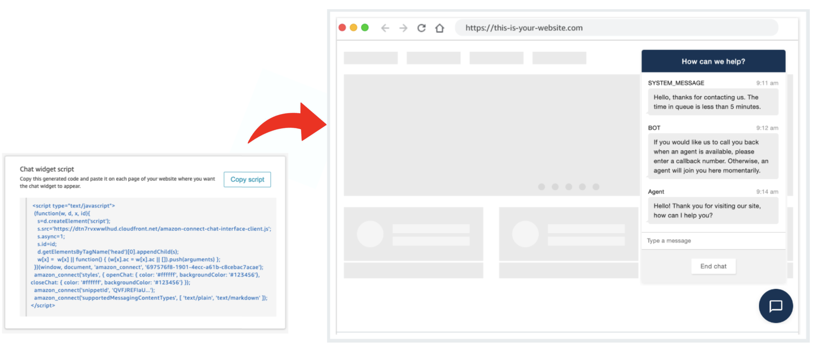

# Basic setup

Render Amazon Connect widget button in the lower-right corner of your website.

> Also refer to the Admin Guide documentation: https://docs.aws.amazon.com/connect/latest/adminguide/add-chat-to-website.html



## Setup

Include the provided `<script>` code snippet on your website:

```html
<!-- EXAMPLE SNIPPET - Edit all "<REPLACE_ME>" values -->
<script type="text/javascript">
  (function (w, d, x, id) {
    s = d.createElement("script");
    s.src =
      "https://<REPLACE_ME>.cloudfront.net/amazon-connect-chat-interface-client.js";
    s.async = 1;
    s.id = id;
    d.getElementsByTagName("head")[0].appendChild(s);
    w[x] =
      w[x] ||
      function () {
        (w[x].ac = w[x].ac || []).push(arguments);
      };
  })(window, document, "amazon_connect", "<REPLACE_ME>");
  amazon_connect("styles", {
    openChat: { color: "#ffffff", backgroundColor: "#07b62a" },
    closeChat: { color: "#ffffff", backgroundColor: "#07b62a" },
  });
  // ALSO: further customize the widget styles: https://docs.aws.amazon.com/connect/latest/adminguide/pass-custom-styles.html
  amazon_connect("snippetId", "<REPLACE_ME>");
  amazon_connect("supportedMessagingContentTypes", [
    "text/plain",
    "text/markdown",
  ]);
  // ALSO: how to pass contact attributes: https://docs.aws.amazon.com/connect/latest/adminguide/pass-contact-attributes-chat.html
  amazon_connect('customerDisplayName', function(callback) {
    const displayName = '<REPLACE_ME>';
    callback(displayName);
  });
</script>
```
